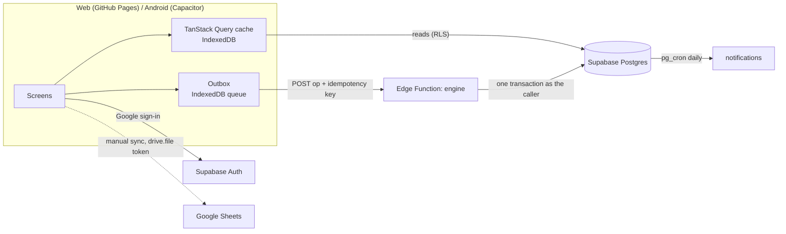

# EggSalt

EggSalt is the business app for **Bisnis Telur Asin**, a salted duck egg business that sells to warung and catering. It runs orders, stock, boiling, supplier returns, money, HPP (cost of goods) and profit in one place. The web app and the Android app are built from one codebase.

Under the hood, every workflow is a **board** the owner can redraw (stages, arrows with rules, actions on entering a stage). Nothing about salted eggs is hard-coded in the screens. It all comes from the Telur Asin template.

## Features

- **Home**: today's orders, a date strip with a calendar for any day, reminders and stock at a glance.
- **Pesanan / Pre-order**: order lists by stage, card detail with next steps, payments, history and undo.
- **Stok**: stock per state (Mentah / Matang / Rusak), lots with a day-5 supplier return countdown, Terima, Rebus and Retur.
- **Uang**: money in and out, unpaid orders, expenses linked to an order or batch.
- **Laporan and Dasbor**: profit and loss, profit per order and customer, Excel download, manual Google Sheets sync.
- **Harga**: dated sell and buy prices with bulk tiers, plus a price history calendar.
- **Kontak, Undangan, Atur papan**: customers and suppliers, inviting people by Google email, and the board editor.
- **Offline first**: data is cached on the device, and changes queue up and are sent when the connection returns.

## Tech stack

| Layer        | Choice                                                                                  |
| ------------ | --------------------------------------------------------------------------------------- |
| Frontend     | Next.js 16 (static export), React 19, TypeScript, Tailwind CSS 4                        |
| UI           | Components in the shadcn/ui style on Radix UI and vaul, lucide icons, Plus Jakarta Sans |
| Data         | TanStack Query (cached in IndexedDB), an outbox queue for writes                        |
| Mobile       | CapacitorJS 8 (Android), bundling the same static export                                |
| Backend      | Supabase: Postgres with row level security, Auth (Google), pg_cron, Edge Functions      |
| Engine       | One Deno Edge Function (`engine`) using postgres.js and zod                             |
| Shared logic | `packages/domain`: money, costing, dates and board rules (pure TypeScript, unit tested) |
| Hosting      | GitHub Pages (web), GitHub Releases (APK), Supabase Cloud (database and engine)         |
| Tooling      | pnpm workspaces, ESLint, Prettier, Husky, lint-staged, commitlint, GitHub Actions       |

## Architecture



- **Reads** go straight from the browser to Postgres. Row level security limits every table to the user's workspaces.
- **Writes** to cards, stock and money go only through the **engine**. Stock and money are **append-only ledgers**: nothing is updated or deleted, and corrections are new reversal rows. Money is whole rupiah. The business time zone is Asia/Jakarta.
- The app is a **static export**: no API routes and no server rendering at runtime. Detail pages use query parameters (`/kartu?id=…`).
- Settings that belong to the owner (prices, contacts, invites, boards) are written directly under RLS.

## Project structure

```
.
├── apps/web/                 Next.js app (web + Android)
│   ├── app/                  Routes (one folder per screen)
│   │   ├── page.tsx          Home
│   │   ├── papan/            Pesanan / Pre-order lists
│   │   ├── kartu/            Order (card) detail: /kartu?id=
│   │   ├── stok/  uang/      Stock, money
│   │   ├── laporan/ dasbor/  Reports, dashboard
│   │   ├── profil/ panduan/  Profile menu, guides
│   │   ├── atur/             Owner settings: harga, kontak, undangan, papan (board editor)
│   │   └── masuk/ mulai/     Sign in, first-run setup
│   ├── components/           UI: sheets (drawer), date picker, select, board editor, …
│   ├── lib/                  Data layer and helpers (see below)
│   └── android/              Capacitor Android project
├── packages/domain/          Shared pure logic: money, costing (HPP), dates, board graph and rules
├── supabase/
│   ├── migrations/           Schema, RLS, ledger functions, report views, cron, template
│   ├── functions/engine/     The engine Edge Function (Deno)
│   └── templates/            Auth email templates
├── docs/design/              PRD, design system, IA, flows, wireframes, architecture, data model
├── scripts/                  Repo checks (blocks env files and large files in commits)
├── .github/workflows/        CI, web deploy, database and engine deploy, Android release
├── TASKS.md                  Backlog, one line per commit
└── CONTRIBUTING.md           Workflow and commit rules
```

Key files in `apps/web/lib`:

| File                                     | Role                                                                              |
| ---------------------------------------- | --------------------------------------------------------------------------------- |
| `supabase.ts`                            | The single Supabase browser client                                                |
| `session.tsx`                            | Signed-in user, current workspace and role                                        |
| `queries.ts`                             | All reads, keyed per workspace                                                    |
| `data.tsx`                               | Query cache persisted to IndexedDB (`CACHE_VERSION`), outbox wiring, error dialog |
| `outbox.ts`                              | Offline write queue with idempotency keys                                         |
| `engine.ts`                              | Calls the engine Edge Function                                                    |
| `board-model.ts`                         | Reads board graphs (which stage means ready, sold or paid)                        |
| `i18n.ts`                                | UI strings, `id` first, with `en` kept in step                                    |
| `sheets.ts`, `xlsx.ts`, `report-file.ts` | Google Sheets sync and the Excel report download                                  |
| `google-sign-in.ts`                      | Google sign-in on web (PKCE) and Android (deep link)                              |
| `native.tsx`                             | Android back button, offline banner, local notifications                          |
| `board-editor.ts`, `format.ts`           | Board editor helpers, rupiah and date formatting                                  |

## Frontend flow

1. **Start**: `AuthGate` sends signed-out users to `/masuk` (Google sign-in). Users without a business go to `/mulai`, which creates a workspace from the Telur Asin template. Everyone else gets the app with its bottom navigation (Home, Pesanan, +, Uang, Profil).
2. **Read**: screens use hooks from `lib/queries.ts`. Results are cached by TanStack Query and saved in IndexedDB, so the app opens instantly with the last data, even offline.
3. **Write**: an action such as a new order, a move to the next stage, Terima, Rebus or a payment goes into the **outbox** with an idempotency key.
4. **Send**: the outbox sends ops in order when online (at start, on reconnect, on focus and periodically). Each result refreshes the affected queries.
5. **Feedback**: every save ends in a small dialog. Success closes itself. A failure offers "Coba lagi", then "Hubungi pengembang".
6. **Android**: the same build is bundled by Capacitor. It adds the hardware back button, an offline banner and local reminders.

## Backend flow (engine)

```
POST /functions/v1/engine  { op, workspaceId, key, payload }
  → CORS, POST only → bearer token (Supabase JWT)
  → begin transaction as the caller → check workspace membership and role
  → run the op → commit → JSON result
```

- **Ops**:
  - Cards: `create-card`, `move-card`.
  - Stock: `opening-stock`, `receive-stock`, `produce`, `return-lot`.
  - Money and history: `record-money`, `undo`.
  - Health check: `ping`.
- **Moving a card** runs the target stage's `onEnter` actions in order (reserve or release stock, consume FIFO, record money, link cards). It then follows an automatic arrow if that arrow's rule holds (e.g. Cek stok → Disiapkan when stock is enough). Every step is a `card_event`.
- **Stock and costing** happen in SQL ledger functions (`receive_purchase`, `produce_batch`, `consume_fifo`, `return_lot`). Lots are used FIFO and keep their unit cost, so HPP per order is exact.
- **Undo** never deletes anything. It writes reversal rows and an `undone` event, and only the latest manual move of a card can be undone.
- **Prices**: the latest sell price valid on the order day is used. A customer segment price beats the general one, and the highest reached quantity tier wins. An order dated before the first price uses the earliest price.
- **Daily job**: `pg_cron` runs `daily_notifications()` for due orders and supplier return reminders.

Main tables: `workspace`, `member`, `invite`, `party`, `item`, `item_state`, `product`, `price`, `card_type`, `field_def`, `board`, `board_version`, `card`, `card_line`, `card_event`, `stock_lot`, `stock_movement`, `reservation`, `money_entry`, `cost_allocation`, `expense_category`, `notification`, `template`. See [docs/design/07-data-model.md](docs/design/07-data-model.md).

## CI/CD

| Workflow              | Trigger                                                       | What it does                                              |
| --------------------- | ------------------------------------------------------------- | --------------------------------------------------------- |
| `ci.yml`              | Pull requests and pushes to `main`                            | Lint, format check, typecheck, domain tests, build        |
| `deploy-web.yml`      | Push to `main`                                                | Builds the static export and publishes it to GitHub Pages |
| `db-deploy.yml`       | Push to `main` touching `supabase/**` or `packages/domain/**` | Runs `supabase db push` and deploys the engine            |
| `release-android.yml` | Tag `v*` or manual run                                        | Builds a signed APK and attaches it to a GitHub Release   |

Repository secrets: `SUPABASE_ACCESS_TOKEN`, `SUPABASE_DB_PASSWORD`, `SUPABASE_PROJECT_REF`, and `ANDROID_KEYSTORE_BASE64`, `ANDROID_KEYSTORE_PASSWORD`, `ANDROID_KEY_ALIAS`, `ANDROID_KEY_PASSWORD` for releases. The repository variable `DEVELOPER_CONTACT` sets the "contact developer" link.

## Local development

```bash
pnpm install
pnpm db:start            # local Supabase (Docker)
pnpm dev                 # Next.js on http://localhost:3000
pnpm typecheck && pnpm lint && pnpm -r test
```

Public build-time variables, which are safe in the client:

| Variable                        | Meaning                                                   |
| ------------------------------- | --------------------------------------------------------- |
| `NEXT_PUBLIC_SUPABASE_URL`      | Supabase project URL                                      |
| `NEXT_PUBLIC_SUPABASE_ANON_KEY` | Supabase anon key (RLS decides what each user can read)   |
| `NEXT_PUBLIC_ENGINE_URL`        | Engine function URL (defaults to the project's function)  |
| `NEXT_PUBLIC_BASE_PATH`         | `/eggsalt-app` on GitHub Pages, empty for Android/local   |
| `NEXT_PUBLIC_DEVELOPER_CONTACT` | `wa.me` or `mailto:` link shown when a save keeps failing |

Android: `pnpm --filter web android:sync`, then open `apps/web/android` in Android Studio.

## Notes

- **Public repository**: never commit secrets, `.env` files or business data. A pre-commit check blocks env files, keystores and files over 500 KB.
- **Workflow**: one small task per commit, as a Conventional Commit `type(scope): description` (header up to 72 characters), with its line ticked in `TASKS.md`. See [CONTRIBUTING.md](CONTRIBUTING.md).
- **Cache shape**: when a query result changes shape, bump `CACHE_VERSION` in `apps/web/lib/data.tsx`, or old cached data can break pages.
- **Tests**: unit tests cover only costing and ledger math in `packages/domain`. The owner does functional testing.
- **UI text** goes through i18n keys (`id` and `en`). Dates are business days in Asia/Jakarta, stored as `YYYY-MM-DD`.

## Docs

| Doc                                                                              | What it covers                                                |
| -------------------------------------------------------------------------------- | ------------------------------------------------------------- |
| [PRD](docs/design/01-prd.md)                                                     | Problem, requirements, the Telur Asin example and its numbers |
| [Design system](docs/design/02-design-system.md)                                 | Tokens, components, patterns, microcopy                       |
| [Information architecture](docs/design/03-information-architecture.md)           | Sitemap, navigation, screens and routes                       |
| [User flows](docs/design/04-user-flow.md)                                        | The key flows                                                 |
| [Wireframes](docs/design/05-wireframes.html)                                     | Clickable phone prototype (open in a browser)                 |
| [Technical architecture](docs/design/06-technical-architecture.md)               | Hosting, frontend, backend, CI/CD                             |
| [Data model](docs/design/07-data-model.md) · [schema](docs/design/07-schema.sql) | Tables, ledgers, costing functions                            |
