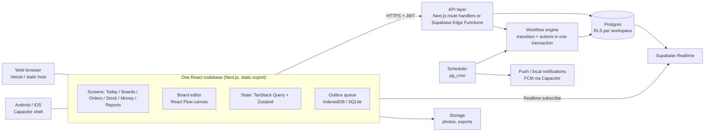

# Business Whiteboard — System Design

**Status:** Draft v0.1 · 2026-09-29 · companion to `01-prd.md`
**Stack given:** React / Next.js, CapacitorJS for mobile

---

## 1. Key design decisions

| # | Decision | Why |
|---|---|---|
| D1 | **Metadata-driven app**: boards, stages, rules, fields and actions are data, not code | This is what makes the workflow customizable instead of ERP-rigid |
| D2 | **Hybrid data model**: custom fields in JSONB, but stock and money in strict typed ledger tables | Owners can reshape the process freely, yet HPP, stock and profit stay correct and auditable |
| D3 | **Workflow = versioned state machine** per card type; cards pin the version they started on | Editing a board never corrupts cards in flight (PRD WB-7) |
| D4 | **Closed action catalog** (≈8 actions) configured by forms; no user scripting | Keeps it simple for non-technical owners and safe to run server-side |
| D5 | **Next.js as a static-exported SPA** for both web and Capacitor; backend is a separate API | Capacitor ships static files, so server components/SSR can't be relied on in the mobile bundle; one codebase serves both |
| D6 | **Supabase (Postgres + Auth + Realtime + Storage)** as the backend, business logic in Postgres functions + a thin API | Small team, row-level security for multi-tenancy, realtime for two owners, transactions for ledger integrity |
| D7 | **Online-first with an outbox queue** in MVP; full offline in M2 | Covers spotty signal on delivery runs without the cost of full sync from day one |
| D8 | **FIFO lot costing** | Lots are needed anyway for the 5-day supplier return window; FIFO gives true HPP per order |

Alternatives considered: fully schemaless (everything JSON) is simpler but makes profit reports unreliable; a generic BPMN engine (Camunda etc.) is far too heavy for the audience; Firebase lacks the transactional SQL the ledgers need.

## 2. Architecture



- **Client**: Next.js App Router with `output: 'export'`; all data fetching client-side. The same build is wrapped by Capacitor for Android/iOS. Native plugins: Push Notifications, Local Notifications (H-1 reminders), Share (WhatsApp receipts), Camera (proof of delivery), Preferences/SQLite (outbox).
- **API**: Every write that changes stock or money goes through the API → workflow engine, never direct table writes from the client. Reads can go direct to Postgres via Supabase with RLS.
- **Workflow engine**: a TypeScript module (runs in the API) that validates a transition, evaluates rules, and executes actions inside one DB transaction; ledger postings use Postgres functions for atomicity.
- **Scheduler**: pg_cron fires time-based things: reminders (H-1), return-window alerts, overdue payments.

## 3. Domain model

### 3.1 Layers

```
┌───────────────────────────────────────────────────────────┐
│ Configuration (what the owner draws)                      │
│  Workspace · CardType · FieldDef · Board(Version) · Stage │
│  Transition · Rule · ActionConfig · View · Template       │
├───────────────────────────────────────────────────────────┤
│ Records (the running business)                            │
│  Card (JSONB fields) · CardEvent (history) · Party         │
├───────────────────────────────────────────────────────────┤
│ Ledgers (strict, append-only)                             │
│  Item · ItemState · StockLot · StockMovement · Reservation│
│  MoneyEntry · CostAllocation                              │
└───────────────────────────────────────────────────────────┘
```

### 3.2 Tables (Postgres)

All tables carry `workspace_id` (RLS key), `created_at`, `created_by`.

**Configuration**

| Table | Key columns | Notes |
|---|---|---|
| `workspace` | id, name, currency (IDR), locale, tray_size | One per business |
| `member` | workspace_id, user_id, role (owner/staff) | Ibu, Ayah |
| `card_type` | id, key, name, icon, kind (`order`/`production`/`purchase`/`delivery`/`custom`) | `kind` tells the engine which ledger semantics apply |
| `field_def` | card_type_id, key, label, type, options, required, formula | Types: text, number, money, date, select, party, item_qty, formula |
| `board` | id, card_type_id, name, active_version_id | |
| `board_version` | id, board_id, version, graph JSONB, published_at | Immutable once published |
| `view` | board_id, type (kanban/list/canvas/calendar), config JSONB | |
| `template` | id, name, payload JSONB | Bundle of all config; "Telur Asin" is one |

`board_version.graph` shape:

```json
{
  "stages": [
    { "id": "baru", "name": "Baru", "x": 0, "y": 0, "color": "gray",
      "onEnter": [], "require": [] },
    { "id": "dikirim", "name": "Dikirim", "x": 600, "y": 0,
      "onEnter": [ { "action": "move_stock", "item": "telur", "from": "matang",
                     "qty": "{{qty}}", "reason": "sale" } ],
      "require": ["delivery_cost"] }
  ],
  "transitions": [
    { "id": "t1", "from": "cek_stok", "to": "disiapkan",
      "when": { "all": [ { "fn": "stock_available", "item": "telur",
                           "state": "matang", "gte": "{{qty}}" } ] } },
    { "id": "t2", "from": "cek_stok", "to": "dijadwal_ulang",
      "when": { "all": [ { "field": "customer.type", "eq": "Warung" },
                         { "not": { "fn": "stock_available", "item": "telur",
                                    "state": "matang", "gte": "{{qty}}" } } ] } }
  ],
  "entry": "baru",
  "terminal": ["selesai", "batal"]
}
```

**Records**

| Table | Key columns | Notes |
|---|---|---|
| `party` | id, kind (customer/supplier), name, type, phone, address, fields JSONB | Customer type = Warung / Catering / custom |
| `card` | id, card_type_id, board_version_id, stage_id, title, party_id, due_at, fields JSONB, parent_card_id, status | `parent_card_id` links an order to its production card |
| `card_line` | card_id, item_id, state, qty, unit_price | Order lines; keeps qty/price typed for reports |
| `card_event` | card_id, type (created/moved/field_changed/action_run/skipped), from_stage, to_stage, payload, actor, idempotency_key | Full history; powers undo and audit |

**Ledgers**

| Table | Key columns | Notes |
|---|---|---|
| `item` | id, name, unit (egg), pack_size (tray 30) | Telur asin bebek |
| `item_state` | item_id, key (mentah/matang/rusak), sellable | States are configurable per item |
| `stock_lot` | id, item_id, state, source (purchase/production), qty_in, qty_remaining, unit_cost, received_at, return_by, supplier_id, source_card_id | Purchase lot: unit_cost 2300, return_by = received + 5d |
| `stock_movement` | id, lot_id, qty (±), reason (purchase/produce_in/produce_out/damage/sale/return/adjust), card_id | Append-only; stock = SUM(qty) |
| `reservation` | card_id, item_id, state, qty, status | Pre-orders hold stock without moving it |
| `money_entry` | id, direction (in/out), kind (revenue/payment/expense/refund/owner_draw), category, amount, method, card_id, occurred_at | LPG, delivery, purchase, sale |
| `cost_allocation` | money_entry_id, target (card_id or lot_id), amount | Splits one trip's delivery cost across orders; puts LPG onto a batch's output lot |

Derived views (SQL views / materialized for reports): `v_stock_on_hand`, `v_available` (on hand − reserved), `v_order_profit`, `v_pnl_daily`, `v_lots_return_due`.

## 4. Workflow engine

### 4.1 Moving a card

```
POST /cards/:id/move { toStage, fields?, idempotencyKey }

BEGIN
  lock card row
  load board_version (the one the card is pinned to)
  check transition from → to exists
  evaluate transition.when  → if false: 409 with human reason
  check toStage.require fields present
  for each action in toStage.onEnter:
      run action (may post stock/money rows, create linked card, schedule reminder)
  insert card_event(moved) + card_event(action_run)*
  update card.stage_id
COMMIT
broadcast via Realtime
```

- **Idempotency key** on every write so the outbox can safely retry after a lost connection.
- **Skip / force move** (PRD WB-8): owner can move to any stage with a reason; the engine records `skipped` and still runs the target's actions unless "don't run actions" is ticked.
- **Undo**: each action type defines a compensating action (move_stock ↔ reverse movement; record_money ↔ reversal entry). Ledgers are never edited, only reversed.

### 4.2 Rule language

JSON condition trees (`all` / `any` / `not`) over:
- card fields (`qty`, `due_at`, `customer.type`)
- built-in functions: `stock_available(item, state)`, `days_until(due_at)`, `now()`
- comparisons: eq, neq, gt, gte, lt, lte, in, empty

Formulas for computed fields (e.g. `total = qty * unit_price`) use a small safe expression evaluator (e.g. `expr-eval` / `filtrex`-style), no JS eval. The editor builds both from dropdowns; users never type JSON.

### 4.3 Action catalog (server implementations)

| Action | Ledger effect | Compensation |
|---|---|---|
| `set_field` | none | restore previous value |
| `reserve_stock` | insert reservation | release |
| `release_reservation` | update reservation | re-reserve |
| `move_stock` | FIFO consume lots → stock_movement rows; records cost of goods on the card | reverse movements |
| `produce` | consume N mentah lots → create matang lot (+ rusak movement); unit cost = (Σ input cost + allocated batch costs) ÷ good qty | reverse |
| `record_money` | money_entry (+ cost_allocation) | reversal entry |
| `create_card` | new card on target board, `parent_card_id` set | cancel child |
| `remind` | scheduled_job row | delete job |

`kind` on the card type limits which actions make sense (e.g. `produce` only on production cards), keeping the editor simple.

## 5. Costing: HPP and profit

**Purchase lot:** bonus eggs (owner-confirmed: supplier adds +5 per purchase) are added to the lot qty at zero cost, so `unit_cost = amount_paid ÷ (qty_paid + bonus)`: 200 paid + 5 free → 460.000 ÷ 205 = Rp 2.244. `bonus_qty` is a supplier setting.

**Production batch** (`produce` action):
```
input_cost   = Σ FIFO cost of N mentah consumed
batch_costs  = Σ cost_allocation to this batch (LPG, urgent extra LPG, other)
good_qty     = N − damaged
unit_cost(matang lot) = (input_cost + batch_costs) ÷ good_qty
```
Losses are absorbed into good eggs' cost, which is how HPP should reflect them. Owner data: loss is a roughly fixed ~2 eggs per batch (eaten at home), so small batches carry a high loss share; the batch planner should group due orders into 30 to 60 egg batches. LPG per batch is a workspace setting (default estimate Rp 1.000 per 60 eggs until the owners measure it); batch duration (≈10 min per 10 eggs, ≈30 min per 60) feeds capacity planning for urgent and pre-order batches.

**Order profit** (`v_order_profit`):
```
revenue         = Σ card_line.qty × unit_price
cogs (HPP)      = Σ FIFO cost of lots consumed by this card's move_stock
direct_costs    = Σ cost_allocation to this card (delivery share, extras)
profit          = revenue − cogs − direct_costs
margin          = profit ÷ revenue
```

**Period P&L:** revenue − COGS − operating expenses not allocated to any card (e.g. general LPG top-up, packaging), excluding `owner_draw`.

**Buy-vs-boil hint:** when planning a batch of n eggs, compare `(n × mentah_cost + expected LPG) ÷ (n − expected_loss)` with the supplier's boiled price (2.500) and show the cheaper option. With current numbers boiling wins from about 24 eggs per batch.

**Supplier return:** a `return` movement against a lot at its unit cost + a `refund` money entry (or supplier credit). The scheduler flags lots where `qty_remaining > 0 and return_by − now ≤ 1 day`.

## 6. Client design

### 6.1 Navigation (mobile first)

Bottom tabs: **Hari ini** (Today) · **Papan** (Boards) · **Stok** · **Uang** (Money) · **Lainnya** (Lists, Reports, Settings). A floating **+** for New order / Expense / Receive stock / New batch.

- *Hari ini*: due orders, deliveries, "boil 45 eggs today" suggestion, returns due, unpaid.
- *Papan*: Kanban per board, swipe card to next stage (transition picker when several are possible), long-press for skip/undo.
- Canvas editor (React Flow / `@xyflow/react`): web-first; on phones a simplified stage list editor.

### 6.2 Code structure (proposed monorepo)

```
apps/
  web/            Next.js (App Router, output: 'export') — shared UI for web + mobile
  mobile/         Capacitor config, native projects (android/, ios/), points to apps/web/out
packages/
  domain/         types, zod schemas for graph/rules/actions, formula evaluator (shared client+server)
  engine/         workflow engine + costing (server)
  ui/             design system (Tailwind + shadcn/ui), Kanban, forms
  templates/      telur-asin.json and future templates
supabase/
  migrations/     SQL tables, RLS policies, views, ledger functions
  functions/      edge functions (API) if not using Next route handlers
```

Sharing `packages/domain` lets the client validate rules and preview "what will happen when I move this card" exactly like the server.

### 6.3 Offline and sync

- **MVP (outbox)**: writes are queued with an idempotency key, applied optimistically in the TanStack Query cache, and replayed when online. Conflicts (card moved by the other owner meanwhile) come back as 409 and the card refreshes with a toast.
- **M2 (full offline)**: local SQLite (Capacitor) or PowerSync/ElectricSQL-style sync of the workspace; engine rules evaluated locally with server as the final authority for ledgers.

## 7. Security & multi-tenancy

- Supabase Auth (phone OTP / WhatsApp-friendly, email as fallback).
- RLS on every table: `workspace_id in (select workspace_id from member where user_id = auth.uid())`.
- Staff role: RLS hides `money_entry` and profit views; engine checks role per stage (optional "who can move here").
- Ledger tables are insert-only for the API role; no updates/deletes.

## 8. Non-functional targets

| Area | Target |
|---|---|
| Speed | Card move < 300 ms p95 online; app usable on low-end Android (2 GB RAM) |
| Size | Initial JS < 300 KB gz for mobile bundle; canvas editor lazy-loaded |
| Reliability | No lost writes: outbox + idempotency; daily Postgres backups |
| Localization | id-ID default, en-US; `Intl.NumberFormat('id-ID', {style:'currency', currency:'IDR'})` |
| Scale (MVP) | Designed for thousands of workspaces × tens of thousands of cards each; no sharding needed |

## 9. Build order (maps to PRD phases)

1. **Foundation**: repo, Supabase schema + RLS, auth, workspace, lists (party, item).
2. **Ledgers**: lots, movements, reservations, money entries, costing functions + SQL views, with tests using the Telur Asin numbers from the PRD.
3. **Engine**: board_version graph schema, move endpoint, rule evaluator, the 8 actions with compensation.
4. **UI**: Today, Kanban, New order, Stock, Money, P&L; then canvas editor.
5. **Template**: Telur Asin template + onboarding "start from template".
6. **Mobile**: Capacitor Android build, push/local notifications, outbox.
7. Pilot with Ibu & Ayah, then M2.

## 10. Risks

| Risk | Mitigation |
|---|---|
| Too much flexibility confuses owners | Templates first; editor hides advanced options; Kanban is the default view, canvas is optional |
| Users draw boards that produce nonsense stock/money | Actions are typed by card kind; ledger invariants (no negative stock unless allowed) enforced in Postgres |
| Next.js features that need a server don't work in Capacitor | Static export only; all server logic behind the API |
| Offline conflicts on shared stock | Server-authoritative ledgers; outbox retries are idempotent; conflicts surfaced, not merged silently |
| Ambiguous inputs in the spec (loss unit, bonus eggs, prices) | Make them workspace settings, not constants (see PRD §9) |
