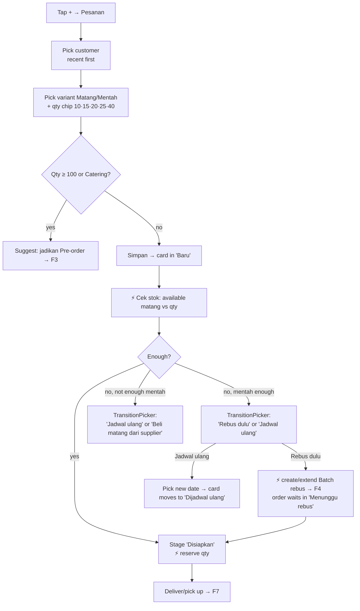
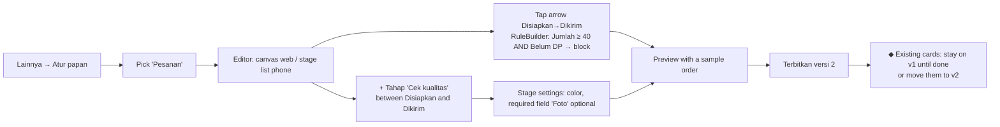

# Business Whiteboard: User Flows

**Status:** Draft v0.1 · 2026-09-29 · Step 4 of the roadmap
**Builds on:** `03-information-architecture.md` (screen ids S01–S26), `02-design-system.md` (components)
**Assumed defaults:** Pre-order is its own board; only Ibu & Ayah (owners) in the pilot, so no staff-only paths yet.

Legend: `[S05]` = screen from the IA screen inventory · ◆ = decision · ⚡ = automatic step action (the system does it) · ↩ = undo available

---

## Flow index

| # | Flow | Who | How often | Priority |
|---|---|---|---|---|
| F1 | First-time setup from the Telur Asin template | Owner | Once | P0 |
| F2 | Warung order (standard) | Ibu | Many per day | P0 |
| F3 | Catering pre-order | Ibu | Weekly | P0 |
| F4 | Boil a batch | Ayah / Ibu | Daily | P0 |
| F5 | Receive eggs from supplier | Ayah | Weekly | P0 |
| F6 | Return unused eggs to supplier | Ayah | Weekly | P0 |
| F7 | Deliver and get paid | Ayah | Many per day | P0 |
| F8 | Record an expense (LPG, delivery trip) | Owner | Daily | P0 |
| F9 | Check profit | Owner | Weekly | P0 |
| F10 | Customize a board | Owner | Occasionally | P0 |
| F11 | Work offline | Owner | When signal drops | P0 (outbox) |

---

## F1 · First-time setup

Goal: from install to a working board in under 5 minutes.

1. Open app → `[S01]` enter phone number → OTP.
2. `[S02]` **Buat usaha**: name "Telur Asin Ibu", type "Makanan / produksi kecil".
3. **Pilih template** → *Telur Asin* (preview shows 4 boards and the stock states).
4. **Isi awal** (each screen skippable):
   - Prices, prefilled from the template: mentah Rp 3.300 / matang Rp 3.500; supplier Rp 2.300 / Rp 2.500, bonus +5.
   - Opening stock: "Berapa telur mentah sekarang?" (QtyStepper, butir/tray).
   - Production costs: LPG per batch (can be left empty, estimate used), expected loss 2.
   - Customers: add a few now or later.
5. ⚡ Workspace, boards, lists and opening lot are created → land on `[S03]` Hari ini with a 3-item checklist ("Buat pesanan pertama", "Undang Ayah", "Lihat papan").
6. Invite second owner: Lainnya → Anggota → share link via WhatsApp → Ayah opens, OTP, joins.

---

## F2 · Warung order (standard)

Goal: record an order in under 20 seconds, and the system figures out stock.

Screens: FAB → `[S06]` New card sheet (customer, variant, qty; price auto-filled, editable under "Detail lainnya") → `[S07]` TransitionPicker on shortage → `[S05]` Card detail.

Details:
- Customer search remembers the last 5; "+ Pelanggan baru" inline (name + phone only).
- Before saving, the sheet shows the effect line: "Stok matang 35 → 15 (dipesan) · Total Rp 70.000".
- Toast "Pesanan tersimpan" with ↩ Batalkan for 5 s.
- If the customer is a warung with an order due at the same time, the SuggestionBanner offers to merge boiling (see F4).

---

## F3 · Catering pre-order

Goal: never be short on the event day; boiling happens H-1 automatically planned.

1. `+ → Pesanan`, pick a Catering customer (or qty ≥ 100) → app switches the sheet to **Pre-order** (event date + time required; delivery address).
2. ⚡ Card created on the Pre-order board in **Diterima**; rule checks lead time:
   - ◆ Event date < H-1? → warning "Kurang dari H-1, perlu rebus mendesak (biaya LPG tambahan)". Owner can continue (card flagged *urgent*).
3. ⚡ **Stok dipesan**: reserve mentah for the qty (+ expected loss, e.g. 100 → reserve 104 for 2 batches).
   - ◆ Not enough mentah → TransitionPicker: "Beli dari supplier" (creates a Pembelian card, F5) · "Pelanggan beli tambahan dari supplier" (note on card, qty reduced) · "Tetap simpan" (flag shortage on Hari ini).
4. ⚡ Reminder scheduled H-1 at 08:00 ("Rebus 100 telur untuk acara Bu Rina besok") and appears on Hari ini.
5. H-1: owner taps the reminder → opens a prefilled **Batch rebus** (F4) linked to this pre-order; batches split by pot size (e.g. 60 + 44).
6. After sorting, pre-order moves to **Siap** with the good matang reserved to it.
7. Event day: F7 deliver and get paid (often a down payment earlier: payment can be recorded at any stage).

---

## F4 · Boil a batch

Goal: boil the right amount, record loss and cost, get correct HPP.

1. Entry points: Hari ini suggestion "Rebus 55 telur hari ini (3 pesanan)" · order shortage (F2) · pre-order reminder (F3) · FAB → Rebus.
2. `[S11]` Boil sheet, prefilled:
   - Qty to boil (sum of linked orders + expected loss), linked orders listed.
   - ◆ Buy-vs-boil hint if qty < ~24: "Batch kecil: beli matang dari supplier lebih murah (Rp 2.500 vs Rp 2.8xx)".
   - ◆ Merge hint if another order is due within 24 h: "Tambah 20 untuk Warung Bu Siti besok?"
   - Urgent toggle (adds extra LPG cost).
3. **Mulai rebus** → card in **Direbus**; optional timer (≈10 min / 10 eggs, ≈30 min / 60) with a local notification.
4. **Sortir**: enter good count (default qty − 2); damaged = rest; optional note ("dimakan sendiri").
5. ⚡ Stock moves: mentah −N; matang +good; rusak +damaged. LPG cost for the batch posted (setting or entered). Matang lot unit cost computed.
6. ⚡ Linked orders move to **Disiapkan** with stock reserved; batch → **Siap**.
7. Result screen: "58 matang siap · HPP Rp 2.339/butir · susut 2".

---

## F5 · Receive eggs from supplier

1. FAB → **Terima stok** (or from a Pembelian card).
2. Supplier (default the one supplier), variant (mentah/matang), qty paid (chips 100 · 200), bonus (prefilled +5), price (prefilled Rp 2.300), paid now? (cash/transfer/later).
3. Effect line: "Stok mentah 40 → 245 · Biaya Rp 460.000 · HPP Rp 2.244/butir · Retur paling lambat Sen, 6 Okt".
4. ⚡ Lot created with return-by = +5 days; expense posted; reorder suggestion cleared.

## F6 · Return unused eggs to supplier

Owner rule: unboiled eggs still left on day 5 are **always** returned to reduce risk. This is a routine task the app creates, not something the owner has to remember.

0. ⚡ Day 4: reminder "Besok retur: 38 telur mentah dari batch 1 Okt". ⚡ Day 5: a **Retur** task appears at the top of Hari ini (and on the Pembelian board), prefilled with the lot's unreserved remaining qty.
1. Trigger: tap the task (or the notification).
2. Tap → Lot detail `[S09]` → **Retur ke supplier** → qty (default remaining), refund type (uang / potong pembelian berikutnya).
3. ◆ Qty > what's not reserved → blocked with reason ("12 sudah dipesan untuk Pre-order Bu Rina").
4. ⚡ Stock −qty from that lot (FIFO respected), refund/credit posted, lot closed if empty.

---

## F7 · Deliver and get paid

1. Hari ini → **Antar hari ini** list (grouped by area/route order) or Papan → column *Disiapkan*.
2. Swipe card → **Dikirim** (or tap *Diambil* for pickup).
   - Required: delivery cost (chips Rp 0 · 5.000 · 10.000, remembered per customer). If several orders go on one trip: "Satu perjalanan?" → select cards → one trip cost split evenly (or by qty).
3. ⚡ Stock matang −qty (from reservation), delivery cost posted and allocated.
4. **Dibayar**: MoneyInput prefilled with the total; chips *Lunas* / *Sebagian*; method cash / transfer / QRIS.
   - ◆ Not paid → card stays in *Terkirim, belum bayar*; appears in Uang → Belum dibayar; reminder after N days.
5. ⚡ Card → **Selesai**; profit shown on the card: "Laba Rp 18.220 (26%)". Share receipt via WhatsApp (P1).

## F8 · Record an expense

1. FAB → **Pengeluaran** → category chips (LPG · Pengiriman · Akomodasi · Pembelian · Lainnya) → amount → optional link:
   - LPG: "Untuk batch?" (pick today's batch) or "Umum" (then spread over the period's batches).
   - Delivery/accommodation: link to an order or a trip.
2. Save → ↩ undo toast. Unlinked expenses count as operating costs in the P&L.

## F9 · Check profit

1. Uang tab `[S12]`: tiles Masuk · Keluar · Laba for Hari · Minggu · Bulan.
2. Tap Laba → `[S19]` Laba rugi: revenue, HPP, gross profit, expenses by category, net profit.
3. Drill down: per order list sorted by profit (lowest first, to spot losing orders) → card detail ProfitBreakdown.
4. Other lenses: Warung vs Catering, per customer, HPP & susut per batch (trend of cost per egg).

---

## F10 · Customize a board (the differentiator)

Example: Ibu wants a "Cek kualitas" step before delivery and a rule that big warung orders need a down payment.

Rules for editing:
- Draft changes never affect live cards until **Terbitkan** (publish).
- Deleting a stage that has cards asks where to move them.
- Preview runs a sample card through the new board and shows which actions fire ("⚡ stok matang −20 at Dikirim").
- Phone editing: rename, reorder, color, add stage, simple rules; the canvas (arrows, branches) is web-first.

## F11 · Work offline

1. Signal drops → OfflineBanner "Offline · perubahan disimpan di HP".
2. Allowed offline (outbox): new order, move card, record payment/expense, boil sort. Disabled: board editing, reports refresh, returns (need current stock).
3. Stock numbers show "≈" and the last sync time.
4. Back online → queue replays in order with idempotency keys → banner "3 perubahan terkirim".
   - ◆ Conflict (e.g. Ayah already moved the same card) → toast "Pesanan ini sudah diubah Ayah" and the card refreshes; the local change is shown in its history as not applied, with a *Terapkan lagi* option.

---

## Cross-flow rules

- Every automatic action (⚡) is visible in the card's Riwayat tab and reversible with ↩ or a compensating action.
- Effect line before saving any stock or money change.
- Payment can be recorded at any stage (DP, pay on delivery, pay later).
- Any stage can be skipped with a reason; the skip is logged.
- Notifications deep-link straight into the step to perform, not a list.
