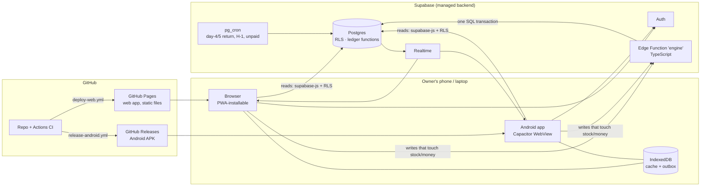

# Business Whiteboard: Technical Architecture

**Status:** v1 · 2026-09-29 · Step 6 of the roadmap
**Supersedes:** sections 1, 2, 4, 6–10 of `00-system-design-draft.md` (that file stays as the early draft; its data model is finalized in step 7)
**Fixed inputs:** React/Next.js, CapacitorJS, deployment hosted by GitHub, owner does testing, dev rules in `CONTRIBUTING.md`

---

## 1. The shape in one picture



**Why this shape:** GitHub Pages only serves static files, so the Next.js app cannot have its own server (no API routes, no server components at runtime). All server logic therefore lives in Supabase: data rules in Postgres, the workflow engine in one Edge Function. The same static build runs on Pages and inside the Android app.

## 2. Decisions

| # | Decision | Reason | Rejected alternative |
|---|---|---|---|
| A1 | **Next.js 15, App Router, `output: 'export'`**, client-rendered | Required by GitHub Pages and Capacitor | SSR on Vercel (not GitHub-hosted, breaks in Capacitor) |
| A2 | **Supabase** for DB, Auth, Realtime, Edge Functions, cron | Postgres transactions for ledgers, RLS for tenancy, free tier fits pilot | Firebase (no SQL transactions for FIFO costing); own server (needs hosting outside GitHub) |
| A3 | **Workflow engine = 1 Edge Function** (`engine`) in TypeScript, sharing `packages/domain` with the client | Same rule evaluator runs in the "what will happen" preview and on the server | Engine in PL/pgSQL (rules duplicated in two languages) |
| A4 | **Ledger primitives as Postgres functions** (`consume_fifo`, `post_movement`, `post_money`, `produce_batch`) called inside the engine's transaction | Stock/money correctness enforced by the database itself, whatever calls it | Ledger math in TS only (a bug could write inconsistent rows) |
| A5 | **Reads direct from Postgres** via supabase-js under RLS; **writes that change stock or money only through `engine`** | Simple fast reads; one guarded door for anything that must stay consistent | Everything through the engine (slower, more code) |
| A6 | **Online-first + outbox** (IndexedDB via Dexie) | Covers weak signal on delivery runs; full offline sync deferred to M2 | PowerSync/ElectricSQL now (more moving parts than the pilot needs) |
| A7 | **Android first**, APK distributed via GitHub Releases (Play Store later) | Owners use Android; zero store overhead for the pilot | iOS in MVP |
| A8 | **Bundled web assets** in the APK (not a remote URL) | Opens instantly and works when offline | `server.url` pointing to Pages (blank screen without signal) |
| A9 | **Money as integer rupiah (`bigint`)**, unit costs as `numeric(12,4)` | No float rounding in HPP/profit | JS floats |
| A10 | **Business time zone `Asia/Jakarta`** for "day 5", H-1 and daily reports; store `timestamptz` | Return deadline must match the owners' calendar day | UTC day boundaries |

## 3. Frontend

| Concern | Choice |
|---|---|
| Language | TypeScript `strict` |
| Styling | Tailwind CSS v4 + shadcn/ui (tokens from `02-design-system.md`) |
| Font | Plus Jakarta Sans via `next/font/google` (self-hosted at build, works offline) |
| Server state | TanStack Query v5 with `persistQueryClient` to IndexedDB (instant cold start, stale data shown with "≈") |
| UI state | Zustand (sheets, current board, draft forms) |
| Forms & validation | react-hook-form + zod (zod schemas live in `packages/domain`, reused by the engine) |
| Board canvas | `@xyflow/react` (React Flow), lazy-loaded only on the editor route |
| Kanban drag/swipe | `@dnd-kit/core` |
| i18n | `i18next` + `react-i18next`, `id` default and `en` (static export friendly, no locale routing) |
| Dates / money | `date-fns` + `date-fns-tz`; `Intl.NumberFormat('id-ID')` |
| Icons | `lucide-react` |
| Routing | Static routes with query params for ids (`/kartu?id=…`), `trailingSlash: true`, `basePath` from `NEXT_PUBLIC_BASE_PATH` (repo name on Pages, empty in Capacitor) |

### 3.1 Write path and the outbox

```mermaid
sequenceDiagram
  participant UI
  participant Q as TanStack mutation
  participant O as Outbox (IndexedDB)
  participant E as Edge Function engine
  participant DB as Postgres
  UI->>Q: moveCard(card, 'dikirim', {ongkir})
  Q->>UI: optimistic update + undo toast
  Q->>O: enqueue {op, payload, idempotencyKey}
  O->>E: POST /engine (JWT) when online
  E->>DB: BEGIN; lock card; check rule; run actions; insert events; COMMIT
  DB-->>E: result (new stage, stock/money deltas)
  E-->>O: 200 → remove from queue
  DB-->>UI: Realtime change → cache refresh (other owner sees it too)
  Note over O,E: 409 conflict → drop op, refresh card, toast "sudah diubah Ayah"
```

- Each op has an `idempotencyKey` (UUID) stored in `card_event`, so a retry after lost signal never double-posts stock or money.
- Undo = the engine's compensating op, sent through the same queue.

## 4. Backend (Supabase)

### 4.1 Pieces

| Piece | Responsibility |
|---|---|
| **Postgres schema** (`supabase/migrations`) | Tables, constraints, RLS, views for reports, ledger functions |
| **Ledger functions** (SQL, `security invoker`) | `consume_fifo(item, state, qty)` returns lots + cost; `produce_batch(...)`; `post_money(...)`; `return_lot(...)`. Constraints forbid negative lot qty |
| **Edge Function `engine`** | Endpoints: `move-card`, `create-card`, `record-money`, `receive-stock`, `produce`, `return-lot`, `undo`. Verifies JWT → membership → runs the op in one transaction (direct Postgres connection via `SUPABASE_DB_URL`) |
| **pg_cron jobs** | 07:00 WIB daily: create day-5 return tasks, day-4 reminders, H-1 boil reminders, overdue-payment flags → rows in `notification` |
| **Realtime** | Subscriptions on `card`, `stock_lot`, `money_entry`, `notification` filtered by workspace |
| **Auth** | Pilot: email magic link or Google sign-in (free). Phone OTP later (needs a paid SMS/WhatsApp provider) |
| **Storage** | Later: delivery photos, exports |

### 4.2 Security

- RLS on every table: row visible only if `workspace_id` belongs to one of the user's memberships.
- Clients get **select** on everything they can see, **insert/update** only on harmless config tables (lists, board drafts). Ledger tables (`stock_movement`, `money_entry`, `stock_lot`) have **no client write policy**: only the engine (service role inside the function, after its own membership check) writes them.
- Ledger rows are append-only (no update/delete grants; corrections are reversal rows).
- Service-role key lives only in Supabase function secrets, never in the repo or the app.

## 5. Mobile (Capacitor)

| Item | Choice |
|---|---|
| Location | `apps/web/android` (Capacitor inside the web app package, `webDir: out`) |
| Plugins (MVP) | `@capacitor/app` (back button, deep links), `@capacitor/local-notifications` (H-1 and day-4 reminders scheduled on the phone), `@capacitor/share` (WhatsApp receipt), `@capacitor/network` (offline banner), `@capacitor/status-bar`, `@capacitor/splash-screen` |
| Later | Push via FCM, camera for delivery proof, live updates (Capgo) to ship web changes without a new APK |
| Build | GitHub Actions: `next build` → `cap sync android` → Gradle `assembleRelease` → signed APK attached to a GitHub Release on tag `v*` |
| Signing | Keystore stored as GitHub Actions secret (base64), never committed |

## 6. Repository layout

Kept small for a 1–2 person project:

```
eggsalt-app/
├── apps/
│   └── web/                  Next.js app + Capacitor
│       ├── app/              routes (static)
│       ├── components/ui/    shadcn/ui + app components
│       ├── features/         today/, board/, stock/, money/, editor/, settings/
│       ├── lib/              supabase client, query client, outbox, i18n
│       ├── locales/          id.json, en.json
│       ├── android/          Capacitor native project
│       └── capacitor.config.ts
├── packages/
│   └── domain/               types, zod schemas, rule & formula evaluator, costing math (pure TS)
├── supabase/
│   ├── migrations/           SQL, one file per change
│   ├── functions/engine/     Edge Function (imports packages/domain)
│   └── seed.sql              Telur Asin template + sample data
├── .github/workflows/        ci, deploy-web, release-android, db-migrate, backup
├── TASKS.md  CONTRIBUTING.md  CLAUDE.md  .env.example
└── package.json  pnpm-workspace.yaml  .nvmrc
```

`packages/domain` has no dependencies on React or Supabase, so its costing and rule code runs identically in the browser, in the engine, and in unit tests.

## 7. Environments and config

| Env | Web | Backend | Notes |
|---|---|---|---|
| local | `pnpm dev` (localhost:3000) | `supabase start` (Docker) | seed with Telur Asin data |
| prod | GitHub Pages | Supabase project `papan-prod` | pilot for Ibu & Ayah |

A separate `dev` cloud project is optional; local Supabase covers development.

`.env.example`:
```
NEXT_PUBLIC_SUPABASE_URL=
NEXT_PUBLIC_SUPABASE_ANON_KEY=      # public by design, RLS protects data
NEXT_PUBLIC_BASE_PATH=              # "/eggsalt-app" on GitHub Pages, empty for Capacitor
NEXT_PUBLIC_ENGINE_URL=             # <supabase-url>/functions/v1/engine
```

## 8. CI/CD (GitHub Actions)

| Workflow | Trigger | Steps |
|---|---|---|
| `ci.yml` | push, PR | install (pnpm cache) → lint → typecheck → unit tests (`packages/domain` only) → `next build` → commitlint on PR commits |
| `deploy-web.yml` | push to `main` | build with `NEXT_PUBLIC_BASE_PATH=/<repo>` → `actions/upload-pages-artifact` → `actions/deploy-pages` |
| `release-android.yml` | tag `v*` | build web (empty basePath) → `cap sync` → Gradle release → sign → attach APK to GitHub Release |
| `db-migrate.yml` | manual (`workflow_dispatch`) | `supabase db push` + `supabase functions deploy engine` to prod |
| `backup.yml` | weekly cron | `pg_dump` of prod → encrypted, uploaded as a private workflow artifact (90-day retention) |

Migrations are never applied automatically on merge; web deploys can't change the database.

## 9. Cost and limits (pilot)

| Service | Plan | Cost | Limit to watch |
|---|---|---|---|
| GitHub Pages | Free for **public** repos; **private repo needs GitHub Pro/Team** | $0 or ~$4/month | Site is public either way; data is not (it lives in Supabase behind login) |
| GitHub Actions | Free minutes | $0 | 2,000 min/month on private repos (Android builds ≈ 8 min each) |
| Supabase | Free | $0 | Project pauses after 7 days with no activity (daily use prevents it); 500 MB DB; no point-in-time restore (hence `backup.yml`) |

At pilot scale (hundreds of orders a month) the database stays far below 1% of the free limits.

## 10. Quality attributes

| Attribute | Target / approach |
|---|---|
| Startup on low-end Android | < 2 s to Hari ini from cache; JS < 300 KB gz initial; canvas lazy-loaded |
| Correctness of money/stock | DB constraints + ledger functions + unit tests on `packages/domain` costing with the owners' real numbers |
| No lost writes | Outbox + idempotency keys |
| Two owners at once | Realtime updates; row lock per card in the engine; conflicts surfaced, never silently merged |
| Observability | Supabase logs for engine; optional Sentry free tier for client errors |
| Accessibility | Design-system rules (48 px targets, contrast AA, font scaling) |

## 11. Risks specific to this architecture

| Risk | Mitigation |
|---|---|
| Edge Function cold start (~0.5–1 s) makes card moves feel slow | Optimistic UI + undo toast; the user never waits for the server |
| Free Supabase project paused | Daily use keeps it alive; `backup.yml` also touches it weekly |
| Static export limits (no dynamic `[id]` pages, no middleware) | Query-param routes; auth guard in a client layout |
| APK updates need reinstalling | Acceptable for the pilot; live updates (Capgo) later |
| Public repo exposes source code | Decided 2026-09-29: public repo. No secrets or business data in the repo; keys only in GitHub/Supabase secrets; gitleaks in pre-commit |

## 12. First development tasks (preview of `TASKS.md` M1.1)

1. `build(repo): initialize pnpm monorepo with next.js static app`
2. `ci(repo): add prettier, eslint, husky, lint-staged and commitlint`
3. `ci(repo): add github actions ci workflow`
4. `feat(ui): add design tokens, fonts and tailwind theme`
5. `feat(web): add app shell with bottom tab bar and routes`
6. `ci(repo): deploy static export to github pages`
7. `build(db): initialize supabase project and local config`

The data model (step 7) comes before the `db` tasks beyond #7.
