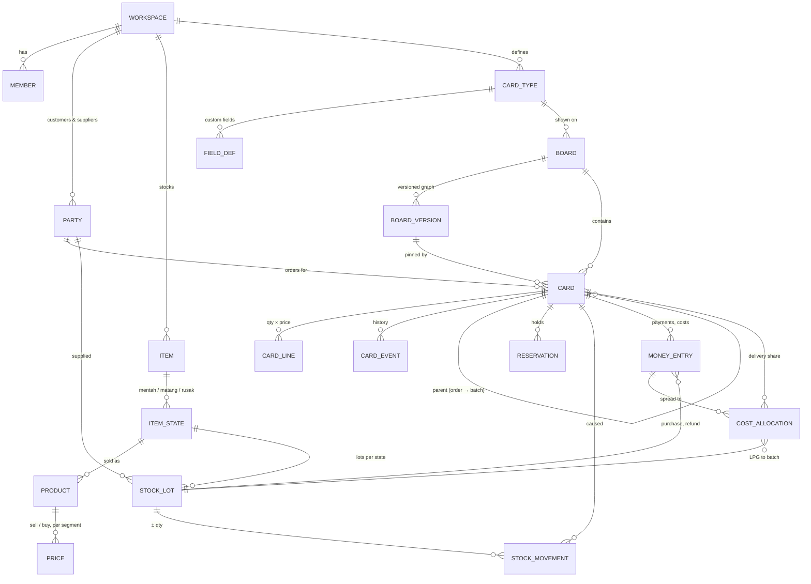

# Business Whiteboard: Data Model

**Status:** v1 · 2026-09-29 · Step 7 of the roadmap
**Schema:** `07-schema.sql` (Postgres/Supabase, loads cleanly on Postgres 16; checked with the Telur Asin numbers, see §6)
**Supersedes:** section 3 of `00-system-design-draft.md`

---

## 1. Three layers

| Layer | What it holds | Who writes it | Can the owner reshape it? |
|---|---|---|---|
| **Configuration** | Card types, fields, boards, board versions (stages, rules, actions as JSON), views, lists, prices | Owner, directly (RLS) | Yes, freely |
| **Records** | Cards (orders, batches, purchases), card lines, card events (history) | Engine only | Content yes, structure via config |
| **Ledgers** | Stock lots and movements, reservations, money entries, cost allocations | Engine only, append-only | No: this is what keeps HPP and profit trustworthy |

## 2. Entity relationships



## 3. Tables at a glance

| Table | Purpose | Key rules |
|---|---|---|
| `workspace` | One business | `timezone` = Asia/Jakarta; `settings` holds LPG per batch, expected loss, max batch size |
| `member` | Ibu, Ayah (later staff) | Role owner/staff |
| `party` | Customers and suppliers | `segment` = Warung/Catering; supplier terms `return_days` 5, `bonus_per_purchase` 5, `min_purchase_qty` 100 |
| `item`, `item_state` | Telur asin bebek in states | `returnable` only on mentah; `sellable` false on rusak |
| `product`, `price` | What is sold/bought and at what price | Prices dated (`valid_from`), optional per segment, so price changes don't rewrite old orders |
| `expense_category` | LPG, delivery, accommodation, other | Editable list |
| `card_type`, `field_def` | Kinds of cards and their custom fields | `kind` (order/production/purchase/custom) limits which actions apply |
| `board`, `board_version` | The drawn workflow | Graph JSON; **published versions are immutable** (trigger) |
| `card` | An order, batch or purchase | Pinned to a board version; `row_version` for conflict detection; human `number` per workspace |
| `card_line` | Qty and price on a card | Price copied at order time |
| `card_event` | Every move, skip, action, undo | `idempotency_key` unique → outbox retries can't double-post |
| `stock_lot` | A batch of eggs in one state | `qty_remaining ≥ 0` (DB check); `return_by` for the day-5 rule; `unit_cost` for HPP |
| `stock_movement` | Every stock change | Append-only; a trigger updates the lot, so stock can't drift |
| `reservation` | Stock held for an order/pre-order | Available = on hand − active reservations |
| `money_entry` | Every rupiah in or out | Integer rupiah; append-only; corrections are reversal rows |
| `cost_allocation` | Spread a cost onto orders or a batch | Exactly one target (card or lot) |
| `notification` | Day-4/day-5 return, H-1 boil, unpaid | `dedupe_key` so cron never duplicates |
| `template` | "Telur Asin" and future templates | Global, copied into a workspace at setup |

## 4. How the business events map to rows

| Event | Rows written (in one transaction) |
|---|---|
| **Receive 200 (+5) mentah at Rp 2.300** | `stock_lot` (205, unit cost 2.243,90, return_by = today + 5) · `stock_movement` +205 purchase · `money_entry` out 460.000 |
| **Boil 60, 58 good, LPG Rp 1.000** | FIFO `stock_movement` −60 production_out from oldest mentah lots · new matang `stock_lot` 58 @ (input cost + 1.000) / 58 · rusak lot +2 at cost 0 · LPG `money_entry` + `cost_allocation` to the matang lot |
| **Order 20 matang** | `card` + `card_line` (20 × 3.500) · `reservation` 20 matang · `card_event` created |
| **Deliver** | FIFO `stock_movement` −20 sale (HPP from lots) · reservation → consumed · delivery `money_entry` + `cost_allocation` to the card · `card_event` moved |
| **Paid** | `money_entry` in customer_payment · card status done |
| **Day-5 return** | `stock_movement` −qty supplier_return on that lot · `money_entry` in supplier_refund |
| **Undo** | Reversal rows pointing to the originals (`reverses_id`), plus `card_event` undone |

**Profit per order** (`v_order_profit`) = Σ card_line revenue − Σ sale movements × lot unit cost − Σ cost allocations to the card.
**Profit for a period** = revenue of delivered orders − their HPP − unallocated expenses. Stock purchases are not an expense until the eggs are sold (they become HPP), so buying 200 eggs doesn't make a week look like a loss.

## 5. The board graph (JSON in `board_version.graph`)

Validated by a zod schema in `packages/domain`; stored as JSON so owners can reshape boards without migrations.

```json
{
  "entry": "baru",
  "terminal": ["selesai", "batal"],
  "stages": [
    { "key": "baru", "name": "Baru", "color": "gray", "pos": [0, 0],
      "onEnter": [{ "action": "check_stock", "item": "telur", "state": "matang" }] },
    { "key": "dikirim", "name": "Dikirim", "color": "blue", "pos": [600, 0],
      "require": ["ongkir"],
      "onEnter": [{ "action": "move_stock", "state": "matang", "qty": "{{lines.qty}}", "reason": "sale" },
                  { "action": "record_money", "kind": "expense", "category": "delivery", "amount": "{{fields.ongkir}}", "allocate": "card" }] }
  ],
  "transitions": [
    { "from": "baru", "to": "disiapkan",
      "when": { "fn": "stock_available", "state": "matang", "gte": "{{lines.qty}}" } },
    { "from": "baru", "to": "menunggu_rebus",
      "when": { "not": { "fn": "stock_available", "state": "matang", "gte": "{{lines.qty}}" } } }
  ]
}
```

Stage keys are stable ids; renaming a stage changes `name` only, so cards and reports keep working.

## 6. Verified against the owners' numbers

Loaded `07-schema.sql` on a local Postgres 16 (with a stub for Supabase's `auth` schema) and ran the ledger functions:

| Step | Result | Expected |
|---|---|---|
| Receive 200 paid + 5 bonus at Rp 2.300 | lot of 205 @ **Rp 2.243,90**, return in **5 days** | ✓ matches PRD |
| Boil 60 → 58 good, batch cost Rp 1.000 | matang lot 58 @ **Rp 2.338,52**, rusak +2 | ✓ (PRD rounded: Rp 2.339) |
| Sell 20 matang (FIFO) | HPP **Rp 46.770** | ✓ |
| Return remaining 145 mentah | stock mentah 0, refund Rp 333.500 in | ✓ |
| Try to sell 100 matang with 38 on hand | **rejected**: "insufficient stock: short by 62" | ✓ nothing written |

## 7. Decisions made in this step

- **Revenue is recognized when an order is delivered**, cash when it is paid. Uang shows both: profit (delivered) and cash in/out (paid).
- **Loss eggs** go to a `rusak` lot at zero cost; their cost is already inside the good eggs' HPP.
- **Refund on return defaults to qty × price paid (Rp 2.300)**. Because bonus eggs lower the lot's unit cost to Rp 2.244, returning eggs shows a small gain (about Rp 56 per egg). The owner can override the refund amount per return.
- **Prices are copied onto order lines**, so changing a price later doesn't change past profit.
- **Custom fields live in `card.fields` (JSONB)**; anything used in money or stock math is a typed column or ledger row instead.

## 8. Open questions (don't block development)

1. When eggs go back to the supplier, is the refund Rp 2.300 per egg, or does the supplier take back bonus eggs first?
2. Do returns get cash back or a discount on the next purchase? (Both are supported; which is the default?)
3. Should catering have its own price? (Supported via `price.segment`, currently the same Rp 3.500.)

## 9. What becomes migrations in development

The SQL file splits into small migrations, one per commit, following the dev workflow:
1. `feat(db): add workspace, member and rls helpers`
2. `feat(db): add parties, items, states, products and prices`
3. `feat(db): add card types, fields, boards and versions`
4. `feat(db): add cards, lines and events`
5. `feat(db): add stock lots, movements, reservations`
6. `feat(db): add money entries and cost allocations`
7. `feat(db): add fifo, purchase, production and return functions`
8. `feat(db): add report views`
9. `feat(db): add notifications and daily cron jobs`
10. `feat(template): seed telur asin template`
